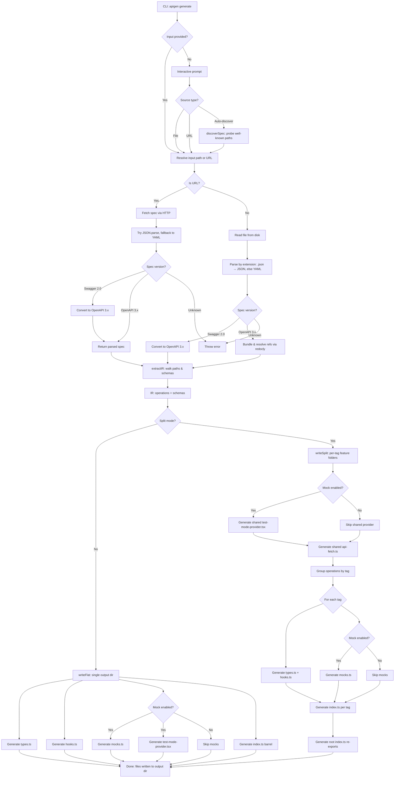

# apigen Pipeline — Flowchart

> Auto-generated from [CLAUDE.md](../../CLAUDE.md)

```mermaid
flowchart TD
    A[CLI: apigen generate] --> B{Input provided?}
    B -->|Yes| C[Resolve input path or URL]
    B -->|No| D[Interactive prompt]
    D --> D1{Source type?}
    D1 -->|File| C
    D1 -->|URL| C
    D1 -->|Auto-discover| E[discoverSpec: probe well-known paths]
    E --> C

    C --> F{Is URL?}
    F -->|Yes| G[Fetch spec via HTTP]
    F -->|No| H[Read file from disk]

    G --> G1[Try JSON.parse, fallback to YAML]
    G1 --> G2{Spec version?}
    G2 -->|Swagger 2.0| G3[Convert to OpenAPI 3.x]
    G2 -->|OpenAPI 3.x| G4[Return parsed spec]
    G2 -->|Unknown| ERR[Throw error]
    G3 --> G4

    H --> H1[Parse by extension: .json → JSON, else YAML]
    H1 --> H2{Spec version?}
    H2 -->|Swagger 2.0| H3[Convert to OpenAPI 3.x]
    H2 -->|OpenAPI 3.x| H4[Bundle & resolve refs via redocly]
    H2 -->|Unknown| ERR
    H3 --> M
    H4 --> M
    G4 --> M

    M[extractIR: walk paths & schemas]
    M --> N[IR: operations + schemas]

    N --> O{Split mode?}
    O -->|No| P[writeFlat: single output dir]
    O -->|Yes| Q[writeSplit: per-tag feature folders]

    P --> R[Generate types.ts]
    P --> S[Generate hooks.ts]
    P --> T{Mock enabled?}
    T -->|Yes| U[Generate mocks.ts]
    T -->|Yes| V[Generate test-mode-provider.tsx]
    T -->|No| W[Skip mocks]
    P --> X[Generate index.ts barrel]

    Q --> Q1{Mock enabled?}
    Q1 -->|Yes| Q2[Generate shared test-mode-provider.tsx]
    Q1 -->|No| Q3[Skip shared provider]
    Q2 --> Q4[Generate shared api-fetch.ts]
    Q3 --> Q4
    Q4 --> Y[Group operations by tag]
    Y --> Z{For each tag}
    Z --> Z1[Generate types.ts + hooks.ts]
    Z --> Z2{Mock enabled?}
    Z2 -->|Yes| Z3[Generate mocks.ts]
    Z2 -->|No| Z4[Skip mocks]
    Z3 --> Z5[Generate index.ts per tag]
    Z4 --> Z5
    Z1 --> Z5
    Z5 --> AA[Generate root index.ts re-exports]

    R --> DONE[Done: files written to output dir]
    S --> DONE
    U --> DONE
    V --> DONE
    X --> DONE
    W --> DONE
    AA --> DONE
```
