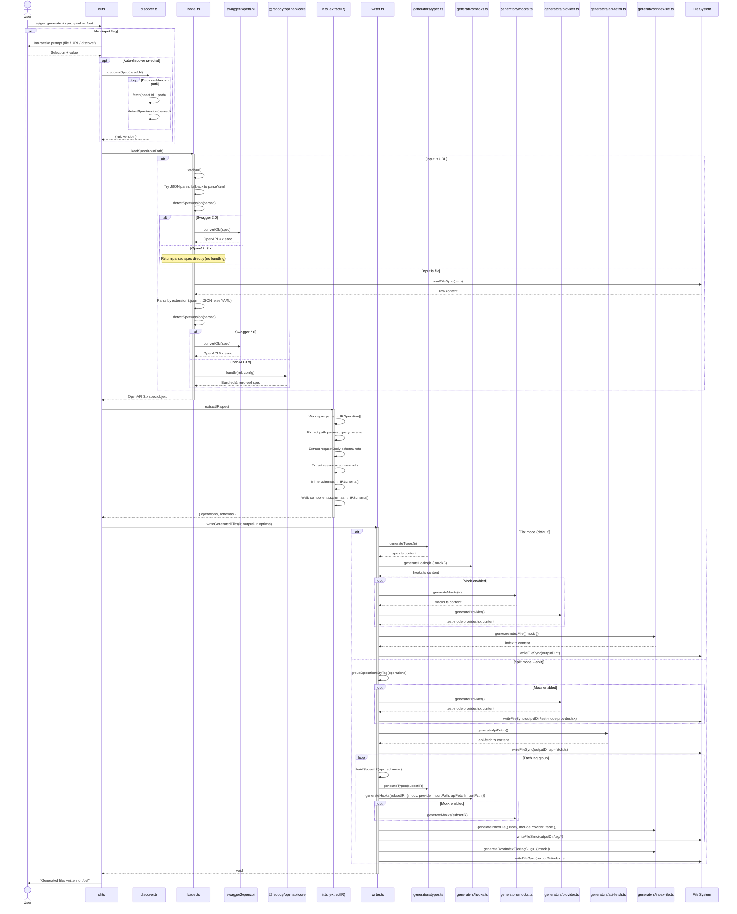

# apigen Pipeline — Sequence Diagram

> Auto-generated from [CLAUDE.md](../../CLAUDE.md)

```mermaid
sequenceDiagram
    actor User
    participant CLI as cli.ts
    participant Discover as discover.ts
    participant Loader as loader.ts
    participant Converter as swagger2openapi
    participant Bundler as @redocly/openapi-core
    participant IR as ir.ts (extractIR)
    participant Writer as writer.ts
    participant GenTypes as generators/types.ts
    participant GenHooks as generators/hooks.ts
    participant GenMocks as generators/mocks.ts
    participant GenProvider as generators/provider.ts
    participant GenApiFetch as generators/api-fetch.ts
    participant GenIndex as generators/index-file.ts
    participant FS as File System

    User->>CLI: apigen generate -i spec.yaml -o ./out

    alt No --input flag
        CLI->>User: Interactive prompt (file / URL / discover)
        User-->>CLI: Selection + value
        opt Auto-discover selected
            CLI->>Discover: discoverSpec(baseUrl)
            loop Each well-known path
                Discover->>Discover: fetch(baseUrl + path)
                Discover->>Discover: detectSpecVersion(parsed)
            end
            Discover-->>CLI: { url, version }
        end
    end

    CLI->>Loader: loadSpec(inputPath)
    activate Loader

    alt Input is URL
        Loader->>Loader: fetch(url)
        Loader->>Loader: Try JSON.parse, fallback to parseYaml
        Loader->>Loader: detectSpecVersion(parsed)
        alt Swagger 2.0
            Loader->>Converter: convertObj(spec)
            Converter-->>Loader: OpenAPI 3.x spec
        else OpenAPI 3.x
            Note over Loader: Return parsed spec directly (no bundling)
        end
    else Input is file
        Loader->>FS: readFileSync(path)
        FS-->>Loader: raw content
        Loader->>Loader: Parse by extension (.json → JSON, else YAML)
        Loader->>Loader: detectSpecVersion(parsed)
        alt Swagger 2.0
            Loader->>Converter: convertObj(spec)
            Converter-->>Loader: OpenAPI 3.x spec
        else OpenAPI 3.x
            Loader->>Bundler: bundle(ref, config)
            Bundler-->>Loader: Bundled & resolved spec
        end
    end

    Loader-->>CLI: OpenAPI 3.x spec object
    deactivate Loader

    CLI->>IR: extractIR(spec)
    activate IR
    IR->>IR: Walk spec.paths → IROperation[]
    IR->>IR: Extract path params, query params
    IR->>IR: Extract requestBody schema refs
    IR->>IR: Extract response schema refs
    IR->>IR: Inline schemas → IRSchema[]
    IR->>IR: Walk components.schemas → IRSchema[]
    IR-->>CLI: { operations, schemas }
    deactivate IR

    CLI->>Writer: writeGeneratedFiles(ir, outputDir, options)
    activate Writer

    alt Flat mode (default)
        Writer->>GenTypes: generateTypes(ir)
        GenTypes-->>Writer: types.ts content
        Writer->>GenHooks: generateHooks(ir, { mock })
        GenHooks-->>Writer: hooks.ts content
        opt Mock enabled
            Writer->>GenMocks: generateMocks(ir)
            GenMocks-->>Writer: mocks.ts content
            Writer->>GenProvider: generateProvider()
            GenProvider-->>Writer: test-mode-provider.tsx content
        end
        Writer->>GenIndex: generateIndexFile({ mock })
        GenIndex-->>Writer: index.ts content
        Writer->>FS: writeFileSync(outputDir/*)
    else Split mode (--split)
        Writer->>Writer: groupOperationsByTag(operations)
        opt Mock enabled
            Writer->>GenProvider: generateProvider()
            GenProvider-->>Writer: test-mode-provider.tsx content
            Writer->>FS: writeFileSync(outputDir/test-mode-provider.tsx)
        end
        Writer->>GenApiFetch: generateApiFetch()
        GenApiFetch-->>Writer: api-fetch.ts content
        Writer->>FS: writeFileSync(outputDir/api-fetch.ts)
        loop Each tag group
            Writer->>Writer: buildSubsetIR(ops, schemas)
            Writer->>GenTypes: generateTypes(subsetIR)
            Writer->>GenHooks: generateHooks(subsetIR, { mock, providerImportPath, apiFetchImportPath })
            opt Mock enabled
                Writer->>GenMocks: generateMocks(subsetIR)
            end
            Writer->>GenIndex: generateIndexFile({ mock, includeProvider: false })
            Writer->>FS: writeFileSync(outputDir/tag/*)
        end
        Writer->>GenIndex: generateRootIndexFile(tagSlugs, { mock })
        Writer->>FS: writeFileSync(outputDir/index.ts)
    end

    Writer-->>CLI: void
    deactivate Writer

    CLI->>User: "Generated files written to ./out"
```
