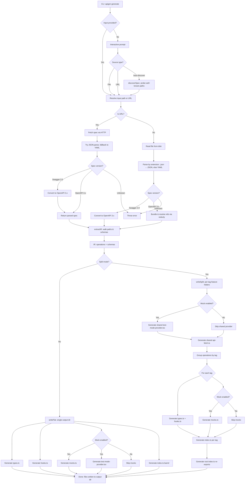
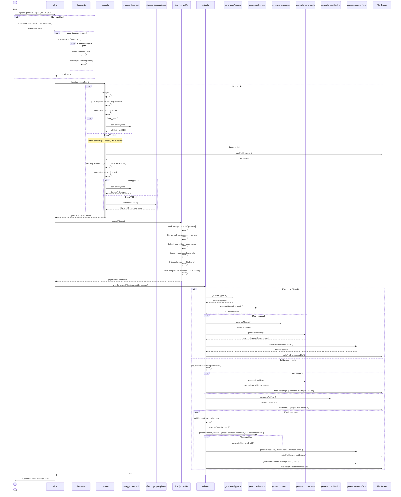

# Audit Fixes Implementation Plan

> **For Claude:** REQUIRED SUB-SKILL: Use superpowers:executing-plans to implement this plan task-by-task.

**Goal:** Fix all 10 issues (3 medium, 7 low) found by the audit-docs agent team across diagrams, docs, and tests.

**Architecture:** Surgical edits to 2 Mermaid diagram files and CLAUDE.md, plus 2 new test files matching existing patterns in `tests/generators/`.

**Tech Stack:** Mermaid, Markdown, Vitest

---

### Task 1: Fix Flowchart — Bundling Scope and Conditionals

**Files:**
- Modify: `docs/diagrams/apigen-flowchart.md`

**Step 1: Replace the flowchart content**

Replace the entire `mermaid` code block in `docs/diagrams/apigen-flowchart.md` with:

~~~markdown

~~~

**Step 2: Verify the diagram renders**

Visually check the mermaid renders without syntax errors (open in VS Code preview or paste at https://mermaid.live).

**Step 3: Commit**

```bash
git add docs/diagrams/apigen-flowchart.md
git commit -m "fix(docs): correct flowchart bundling scope and add mock conditionals"
```

---

### Task 2: Fix Sequence Diagram — Bundling Scope, api-fetch, Labels

**Files:**
- Modify: `docs/diagrams/apigen-sequence.md`

**Step 1: Replace the sequence diagram content**

Replace the entire `mermaid` code block in `docs/diagrams/apigen-sequence.md` with:

~~~markdown

~~~

**Step 2: Verify the diagram renders**

Visually check the mermaid renders without syntax errors.

**Step 3: Commit**

```bash
git add docs/diagrams/apigen-sequence.md
git commit -m "fix(docs): correct sequence diagram bundling scope, add api-fetch, fix labels"
```

---

### Task 3: Update CLAUDE.md — Build Command, Architecture Tree, Split Mode, Deps

**Files:**
- Modify: `CLAUDE.md`

**Step 1: Update Build command (line 12)**

Replace:
```
- **Build**: `bun build ./src/cli.ts --outdir dist --target node`
```
With:
```
- **Build**: `bun build ./src/cli.ts --outdir dist --target node && bun build ./src/index.ts --outdir dist --target node --format esm && tsc --emitDeclarationOnly --outDir dist`
```

**Step 2: Update Key deps (line 14)**

Replace:
```
- **Key deps**: commander, @redocly/openapi-core, swagger2openapi, yaml
```
With:
```
- **Key deps**: commander, @redocly/openapi-core, swagger2openapi, yaml, @faker-js/faker, @inquirer/prompts
```

**Step 3: Add api-fetch.ts to Architecture tree (after line 42)**

Replace:
```
│   ├── provider.ts     # → React test mode context provider
│   └── index-file.ts   # → barrel re-exports
```
With:
```
│   ├── provider.ts     # → React test mode context provider
│   ├── index-file.ts   # → barrel re-exports
│   └── api-fetch.ts    # → shared apiFetch helper (split mode)
```

**Step 4: Add split mode to Generated Output section (after line 78)**

After the line `- `index.ts` — barrel re-exports`, add:

```

With `--split` flag, output is organized into per-tag feature folders:
- Root: `test-mode-provider.tsx`, `api-fetch.ts`, `index.ts` (re-exports all tags)
- Per-tag: `{tag}/types.ts`, `{tag}/hooks.ts`, `{tag}/mocks.ts`, `{tag}/index.ts`
```

**Step 5: Commit**

```bash
git add CLAUDE.md
git commit -m "docs: update CLAUDE.md with build cmd, api-fetch, split mode, deps"
```

---

### Task 4: Write tests for generateIndexFile

**Files:**
- Create: `tests/generators/index-file.test.ts`

**Step 1: Write the test file**

```typescript
import { describe, it, expect } from 'vitest'
import { generateIndexFile, generateRootIndexFile } from '../../src/generators/index-file'

describe('generateIndexFile', () => {
  it('includes types, hooks, mocks, and provider when mock is enabled', () => {
    const output = generateIndexFile({ mock: true })

    expect(output).toContain("export * from './types'")
    expect(output).toContain("export * from './hooks'")
    expect(output).toContain("export * from './mocks'")
    expect(output).toContain("export * from './test-mode-provider'")
  })

  it('excludes mocks and provider when mock is disabled', () => {
    const output = generateIndexFile({ mock: false })

    expect(output).toContain("export * from './types'")
    expect(output).toContain("export * from './hooks'")
    expect(output).not.toContain("mocks")
    expect(output).not.toContain("test-mode-provider")
  })

  it('excludes provider when includeProvider is false', () => {
    const output = generateIndexFile({ mock: true, includeProvider: false })

    expect(output).toContain("export * from './mocks'")
    expect(output).not.toContain("test-mode-provider")
  })

  it('includes auto-generated headers', () => {
    const output = generateIndexFile()

    expect(output).toContain('/* eslint-disable */')
    expect(output).toContain('auto-generated')
  })
})

describe('generateRootIndexFile', () => {
  it('re-exports all tag slugs', () => {
    const output = generateRootIndexFile(['users', 'pets'], { mock: true })

    expect(output).toContain("export * from './users'")
    expect(output).toContain("export * from './pets'")
    expect(output).toContain("export * from './test-mode-provider'")
  })

  it('excludes provider when mock is disabled', () => {
    const output = generateRootIndexFile(['users'], { mock: false })

    expect(output).toContain("export * from './users'")
    expect(output).not.toContain("test-mode-provider")
  })

  it('includes auto-generated headers', () => {
    const output = generateRootIndexFile(['users'])

    expect(output).toContain('/* eslint-disable */')
    expect(output).toContain('auto-generated')
  })
})
```

**Step 2: Run tests to verify they pass**

Run: `bun test tests/generators/index-file.test.ts`
Expected: All 6 tests PASS

**Step 3: Commit**

```bash
git add tests/generators/index-file.test.ts
git commit -m "test: add tests for generateIndexFile and generateRootIndexFile"
```

---

### Task 5: Write tests for generateApiFetch

**Files:**
- Create: `tests/generators/api-fetch.test.ts`

**Step 1: Write the test file**

```typescript
import { describe, it, expect } from 'vitest'
import { generateApiFetch } from '../../src/generators/api-fetch'

describe('generateApiFetch', () => {
  it('generates apiFetch function', () => {
    const output = generateApiFetch()

    expect(output).toContain('export function apiFetch')
    expect(output).toContain('fetch(path')
    expect(output).toContain('Content-Type')
    expect(output).toContain('application/json')
  })

  it('includes error handling', () => {
    const output = generateApiFetch()

    expect(output).toContain('if (!res.ok)')
    expect(output).toContain('throw new Error')
  })

  it('includes auto-generated headers', () => {
    const output = generateApiFetch()

    expect(output).toContain('/* eslint-disable */')
    expect(output).toContain('auto-generated')
  })
})
```

**Step 2: Run tests to verify they pass**

Run: `bun test tests/generators/api-fetch.test.ts`
Expected: All 3 tests PASS

**Step 3: Commit**

```bash
git add tests/generators/api-fetch.test.ts
git commit -m "test: add tests for generateApiFetch"
```

---

### Task 6: Run Full Test Suite

**Files:** (none — verification only)

**Step 1: Run all tests**

Run: `bun test`
Expected: All tests pass (original 56 + 9 new = 65 tests)

**Step 2: Run typecheck**

Run: `bun run typecheck`
Expected: No errors
